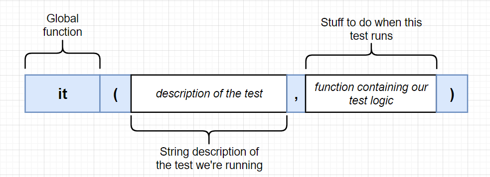

## Test in React

---

### create-react-app으로 얻는 것

- React 라이브러리
- Webpack → 분리된 파일을 하나로 통합
- Babel → 최신 문법을 ES5로 변환
- Jest → 자동화 테스트

### 테스트 실행

간단한 테스트를 위해 아래의 App.test.js 파일에 아래 코드를 입력

```
it("renders without crashing", () => {
  const div = document.createElement("div");
  ReactDOM.render(<App />, div);

  expect(div.innerHTML).toContain("Hello World!");

  ReactDOM.unmountComponentAtNode(div);
});
```

그리고 터미널에 `npm test run`을 입력시 테스트 진행

```
 PASS  src/App.test.js
  √ renders without crashing (36 ms)

Test Suites: 1 passed, 1 total
Tests:       1 passed, 1 total
Snapshots:   0 total
Time:        4.524 s
```

- 진행 순서
  1. 터미널에 `npm run test`입력
  2. Jest가 테스트를 시작
  3. Jest는 .test.js 형식의 모든 test 파일을 검색하고 해당 파일들을 실행시킴
  4. Jest는 터미널에 테스트 결과를 표출함
  5. Jest는 테스트되었던 파일에 변경이 있는 경우 감지하여 테스트 재진행

### 어떤 것을 테스트해야할까?

Jest로 테스트를 실행하면 런타임 이전에 오류 잡아 양질의 서비스를 제공할 수 있는 점에서 이득이 있다는 것은 이해했다.
그렇다면 우리는 테스트파일에서 `어떤 것을 테스트 해야할까?`

테스트 해야할 사항을 정할 때 다음을 진행해보자. 어떤 것을 테스트 코드로 작성해야할지 고민될 때 도움이 될 것이다.

- **진행과정**

  1. 전체 앱을 기능 단위로 분류한다.

     ex. 새로운 코멘트 추가 기능을 담당하는 CommentBox 컴포넌트, 전체 코멘트를 나열하는 CommentList 컴포넌트 등

  2. 각 기능에서 코드별로 처리하는 기능이 무엇인지 다른 사람에게 설명해주는 상상해본다.
  3. 내가 예상한 기능을 테스트 파일에 작성한다.

### 테스트 폴더구조 컨벤션

테스트 파일을 관리하는 방법은 각자의 취향 혹은 프로젝트 성격마다 다를 것이다. 하지만, 많은 개발자들은 다음과 같은 방법으로 테스트 파일을 관리한다.

```
src
├ components
└ 이것저것  └ __ test __

```

**test**폴더 안의 테스트 파일은 .test.js의 형식을 취하지 않아도 Jest가 테스트 파일로 인식한다. 하지만, .test.js 확장자를 설정하는 것이 직관성을 위해 좋을 것이다.

### 테스트 코드 구조



- **구성**

  - it은 전역함수로 두 가지 내용을 담는다.
  - 첫 번째 요소는 테스트에 대한 설명이다. 테스트를 진행했을 때 터미널에 표시되는 문구를 기입하면 된다. 협업에서는 어떤 것에 대한 테스트인지 동료가 의도를 쉽게 알 수 있도록 설명하는 것이 좋을 것이다.
  - 둘째 요소는 실제 test를 진행하는 코드가 담기는 구역이다. 그 안에는 다음과 같은 형식의 코드가 담긴다.

    ```
    it("shows a comment box", () => {
    const div = document.createElement("div");

    ReactDOM.render(<App />, div);

    // Looks inside the div
    // and checks to see if the CommentBox is in there

    ReactDOM.unmountComponentAtNode(div);
    });

    ```

    npm run test는 브라우저 상에서 실행하는 것이 아니기 때문에 실제 DOM이 생성되는 것은 아니다. 그 대신에

    1. fake div를 설정한다.(첫 째줄)
    2. 그 안에 <App/>을 렌더링한다.
    3. 기능이 예상대로 작동되는지 test코드를 작성한다 // 생략
    4. fake div를 삭제하여 부수효과 혹은 테스트 시간을 최소화한다.

### 테스트 제한범위

App.test.js에서 모든 컴포넌트의 테스트를 진행하면 어떻게 될까?

테스트 중 오류가 발생하여도, 프로젝트가 작거나 테스트 로직이 복잡하지 않을 경우에 어떤 부분을 수정해야할지 알아차리기 쉽다.

하지만, 그렇지 않을 경우 예측 가능성이 줄어들며, 유지보수성이 떨어지게 된다. 따라서 App.test.js와 같이 전체 컴포넌트 테스트 파일에서 각 컴포넌트에 해당하는 기능을 테스트 하는 것은 좋지 않다.

그 대신 **각 컴포넌트가 렌더링 되고 있는지**정도의 범위에서만 테스트하고, 세부 기능은 그 기능을 담당한 컴포넌트의 테스트 파일에서 진행하는 것이 유지보수성을 향상시킬 수 있다.

### Enzyme

출처:
<a href='https://enzymejs.github.io/enzyme/'>Enzyme 공식문서 - Airbnb</a>

<a href='https://medium.com/wesionary-team/react-testing-library-vs-enzyme-afd29db380ac'>React Testing Library Vs. Enzyme</a>

Enzyme은 Airbnb에서 만든 인기있는 테스팅 라이브러리이다. 이것은 우리에게 리액트 컴포넌트의 실행 세부사항을 테스트하는 메커니즘을 제공한다. 우리는 이것을 통해 테스트 코드에 적은 컴포넌트와 자식 컴포넌트의 state, props 등에 쉽게 접근할 수 있다.

즉, Enzyme을 사용하면 손쉽게 세부 테스팅 코드에 접근 및 설정이 가능한 것이다.

이러한 이점으로 많은 개발자들이 Enzyme을 사용하고, 나 역시 Enzyme을 사용함으로써 테스트 코드 작성의 편의성을 높이려고 한다.

- **dependency 설정**

  ```
  npm i --save enzyme enzyme-adapter-react-'자신의 react 버전'
  ```

  ex. 만약 react 버전이 v16.xx.xx 일 경우 `enzyme-adapter-react-16` 으로 설치하면 된다.

  **※ react v17.xx.xx인 경우 `npm i --save enzyme @wojtekmaj/enzyme-adapter-react-17` 으로 설치한다.**

- **사용법**

  ```
  import Enzyme from 'enzyme';
  import Adapter from 'enzyme-adapter-react-16';

  Enzyme.configure({ adapter: new Adapter() });
  ```
